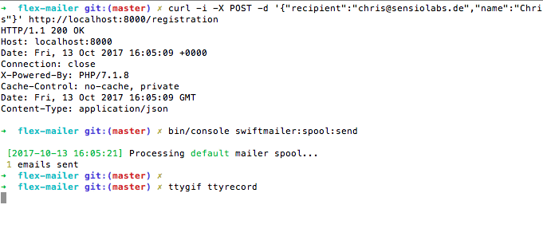

# Flex Example Mailer

This is a small showcase on how to bootstrap a simple mailing service with Symfony Flex.

## Requirements

* PHP >= 7.1.3
* Composer

## Steps

### 1. Create project

```bash
$ composer create-project symfony/skeleton:^4.0@beta flex-mailer
$ cd flex-mailer
$ composer req logger cli annotations mailer twig 
```


   
### 2. Configure routing and swiftmailer

```yaml
# config/packages/swiftmailer.yaml
swiftmailer:
    url: '%env(MAILER_URL)%'
    spool:
        path: '%kernel.project_dir%/var/mailing-spool'
```

```yaml
# config/routes.yaml
controllers:
   resource: ../src/Controller/
   type: annotation
   defaults:
       _format: json
```

### 3. Implement Controller as HTTP glue

```php
    // src/Controller/MailingController.php
 
    /**
     * @Route("registration", name="registration", methods={"POST"})
     */
    public function registrationAction(Request $request, Mailer $mailer, string $recipient): Response
    {
        $data = json_decode($request->getContent(), true);
     
        if (!array_key_exists('recipient', $data)) {
            throw new BadRequestHttpException('Request payload must contain "recipient" key.');
        }
        
        $mailer->sendRegistrationMail($data['recipient'], $data);
        
        return Response::create();
    }
```
       
### 4. Implement Mailer Business Logic to render templates and spool mails

```php
class Mailer
{
    private $swiftMailer;
    private $twig;
    
    public function __construct(\Swift_Mailer $swiftMailer, Environment $twig)
    {
        $this->swiftMailer = $swiftMailer;
        $this->twig = $twig;
    }
    
    public function sendRegistrationMail(string $recipient, array $data): void
    {
        $this->sendMail('registration.twig', $recipient, $data);
    }
    
    // way more mail functions...
    
    private function sendMail(string $template, string $recipient, array $data): void
    {
        $template = $this->twig->load($template);
     
        $subject = $template->renderBlock('subject', $data);
        $htmlContent = $template->renderBlock('html_content', $data);
        $textContent = $template->renderBlock('text_content', $data);
        
        /** @var \Swift_Message $message */
        $message = $this->swiftMailer->createMessage();
        $message
            ->setTo($recipient)
            ->setFrom('noreply@example.org')
            ->setSubject($subject)
            ->setBody($textContent, 'text/plain')
            ->addPart($htmlContent, 'text/html');
            
        $this->swiftMailer->send($message);
    }
}
```

### 5. Start app and test

```bash
$ php -S 127.0.0.1:8000 -t public
  
  PHP 7.1.8 Development Server started at Fri Oct 27 21:19:29 2017
  Listening on http://127.0.0.1:8000
  Document root is /path/to/flex-mailer/public
  Press Ctrl-C to quit.
```

```bash
$ curl -i -X POST -d '{"recipient":"chris@sensiolabs.de","name":"Chris"}' http://localhost:8000/registration
  
  HTTP/1.1 200 OK
  Host: localhost:8000
  Date: Fri, 13 Oct 2017 15:03:57 +0000
  Connection: close
  X-Powered-By: PHP/7.1.8
  Cache-Control: no-cache, private
  Date: Fri, 13 Oct 2017 15:03:57 GMT
  Content-Type: application/json
  
$ bin/console swiftmailer:spool:send
  
  [2017-10-27 19:11:43] Processing default mailer spool... 
   1 emails sent
```


